# 🏛️ RoadWatch — Complete System Architecture Specification

> **Platform:** RoadWatch (AI-Powered Road Transparency & Civic Accountability Platform)  
> **Target Event:** IIT Madras Road Safety Hackathon 2026 | CoERS & RBG Labs  
> **Document Version:** 1.0.0 | Production Architecture Specification  
> **Repository:** [Devarsh-7/RoadWatch](https://github.com/Devarsh-7/RoadWatch)

---

## 📑 Table of Contents
1. [Executive Architectural Summary](#-executive-architectural-summary)
2. [High-Level System Context (C4 Model - Level 1 & 2)](#-high-level-system-context)
3. [Component & Layer Breakdown](#-component--layer-breakdown)
   - [3.1 Frontend Presentation Tier (React 19 + Vite)](#31-frontend-presentation-tier)
   - [3.2 API & Business Logic Tier (FastAPI)](#32-api--business-logic-tier)
   - [3.3 AI & RAG Intelligence Engine (Gemini 1.5 Flash + FAISS)](#33-ai--rag-intelligence-engine)
   - [3.4 Data Persistence & Storage Tier (PostgreSQL / Supabase & SQLite)](#34-data-persistence--storage-tier)
4. [Data Flow & Lifecycle Sequence Diagrams](#-data-flow--lifecycle-sequence-diagrams)
   - [4.1 Citizen Complaint & Priority Recalculation Lifecycle](#41-citizen-complaint--priority-recalculation-lifecycle)
   - [4.2 Repair Project & Citizen Verification Consensus Lifecycle](#42-repair-project--citizen-verification-consensus-lifecycle)
   - [4.3 Retrieval-Augmented Generation (RAG) Query Pipeline](#43-retrieval-augmented-generation-rag-query-pipeline)
   - [4.4 Smart Authority Complaint Routing Engine](#44-smart-authority-complaint-routing-engine)
5. [Database Schema & Entity-Relationship Architecture](#-database-schema--entity-relationship-architecture)
6. [Core Scoring & Decision Algorithms](#-core-scoring--decision-algorithms)
   - [6.1 Road Transparency Index (0–100)](#61-road-transparency-index)
   - [6.2 Dynamic Complaint Priority & Trust Scoring](#62-dynamic-complaint-priority--trust-scoring)
   - [6.3 Contractor Accountability & Quality Scoring](#63-contractor-accountability--quality-scoring)
7. [Security, Governance & Anti-Abuse Architecture](#-security-governance--anti-abuse-architecture)
   - [7.1 Defense-in-Depth Security Matrix](#71-defense-in-depth-security-matrix)
   - [7.2 Role-Based Access Control (RBAC) & Jurisdictional Scoping](#72-role-based-access-control-rbac--jurisdictional-scoping)
   - [7.3 Tiered Sliding-Window Rate Limiting](#73-tiered-sliding-window-rate-limiting)
8. [Data Ingestion & Integration Pipelines](#-data-ingestion--integration-pipelines)
9. [Physical Deployment & Infrastructure Topology](#-physical-deployment--infrastructure-topology)
10. [Repository File Map](#-repository-file-map)

---

## 🔭 Executive Architectural Summary

**RoadWatch** is a multi-tier, civic-tech and governance platform designed to make India's ₹4.76 lakh crore road network accountable to citizens. The system pairs open-government fiscal data with crowd-sourced verification, smart complaint routing, and real-time AI question-answering.

### Key Architectural Pillars
- **Decoupled Client-Server Model:** A React 19 Single Page Application (SPA) communicating over authenticated and rate-limited REST APIs with a high-throughput asynchronous FastAPI backend.
- **Civic Trust & Consensus Without Friction:** Employs persistent client device fingerprints (`roadwatch_device_id`) allowing citizens to file issues, upvote reports, and verify repairs without forced account creation, backed by multi-layer anti-bot defenses.
- **Deterministic RAG Architecture:** Vector embeddings with FAISS and Google Gemini 1.5 Flash grounded strictly on verified road budgets, contractors, and repair dates, eliminating hallucinations.
- **Hierarchical Governance (RBAC + Jurisdictional IDOR Prevention):** Officers operate under geographic constraints (National Super Admin → State Authority → District Collector / PWD Engineer).

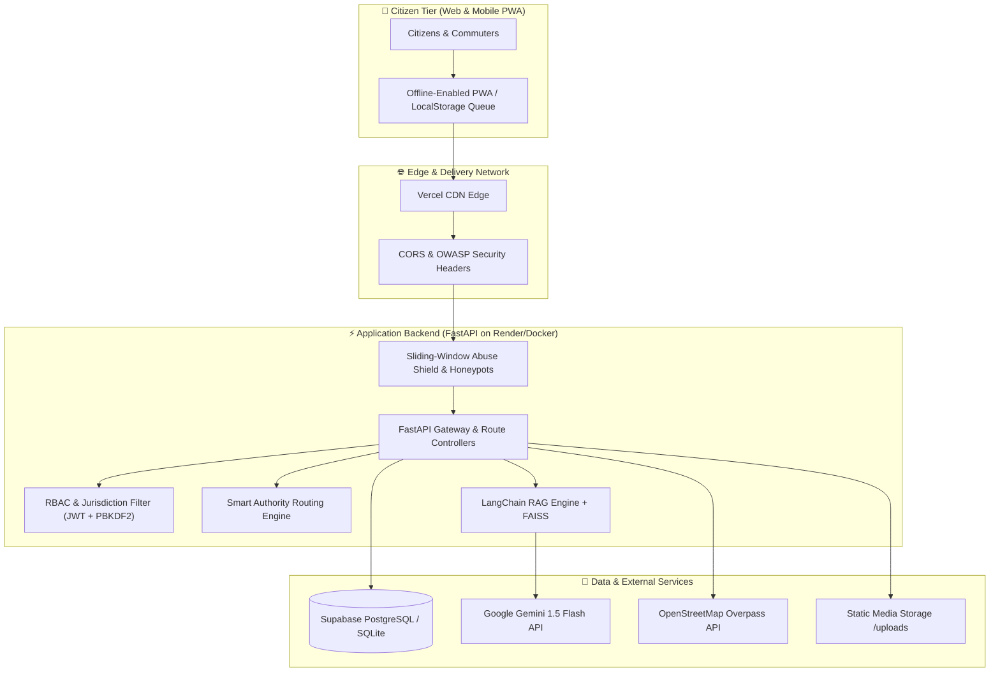

---

## 🏛️ High-Level System Context

RoadWatch operates across three primary actor boundaries:

1. **Citizens / Commuters:** Search roads by name, NH code, or GPS location; review contractor history and budget transparency; report hazards (potholes, flooding, missing barriers); and verify contractor repairs.
2. **Administrative Officers & Engineers:** PWD Executive Engineers, NHAI Regional Officers, and District Collectors review incoming complaints, allocate contractors, update repair milestones, upload before/during/after site photos, and monitor SLA escalations.
3. **External Government & Geospatial Ecosystems:** OpenStreetMap Overpass QL API, MoRTH datasets, and NHAI portals feed road geometries and baseline infrastructure records.

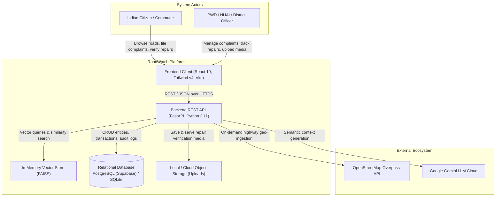

---

## 🧩 Component & Layer Breakdown

### 3.1 Frontend Presentation Tier

The frontend is built using **React 19** and bundled with **Vite 8**. It implements an accessible glassmorphism theme using **Tailwind CSS v4** and micro-interactions orchestrated via **Framer Motion**.

```
frontend/src/
├── components/                 # Reusable UI widgets & functional elements
│   ├── Navbar.jsx              # Responsive navigation with emergency action links
│   ├── Footer.jsx              # Civic accountability citations and data sources
│   ├── RoadCard.jsx            # Road summary card with dynamic health badge
│   ├── BeforeAfterSlider.jsx   # Interactive image comparison slider for repair proof
│   ├── CitizenVerificationWidget.jsx # Consensus voting & quality rating UI
│   ├── ComplaintActionWidget.jsx    # Upvoting, severity flagging, and status confirmations
│   ├── ContractorScoreCard.jsx      # Performance & accountability breakdown
│   ├── RepairTimeline.jsx      # 6-stage vertical milestone progression tracker
│   ├── RepairMediaGallery.jsx  # Categorized inspection photo gallery (before/during/after)
│   ├── HeroScene.jsx           # Canvas-assisted landing page visualizer
│   └── AdminExitHeader.jsx     # Return-to-public bar for authenticated officers
├── pages/                      # Page view controllers
│   ├── LandingPage.jsx         # Hero, value proposition, live platform metrics
│   ├── SearchPage.jsx          # Multi-facet road search (text, state, type, GPS radius)
│   ├── RoadDetailPage.jsx      # Comprehensive road dossier (finances, contractor, complaints)
│   ├── ComplaintPage.jsx       # Citizen complaint submission wizard with GPS capture
│   ├── ChatbotPage.jsx         # RAG-powered interactive conversational assistant
│   ├── DashboardPage.jsx       # State spending comparisons & Leaflet geospatial heatmaps
│   ├── RepairTrackingPage.jsx  # Live repair lifecycle tracker for specific roads
│   ├── RepairDashboardPage.jsx # Public directory of contractor rankings & ongoing works
│   ├── AdminLoginPage.jsx      # Officer authentication with password recovery
│   └── AdminDashboardPage.jsx  # Role-scoped administrative inspection & command desk
├── api.js                      # Axios instance with JWT interceptor & offline queue sync
└── index.css                   # Tailwind v4 theme definitions and animation keyframes
```

#### Offline & PWA Resilience
- **Offline Complaint Queue (`api.js`):** When a citizen submits a complaint in a poor-connectivity zone, the submission is serialized into `localStorage` under `roadwatch_complaint_queue`.
- **Automatic Re-synchronization:** The application registers a `window.addEventListener('online')` hook in `App.jsx`. Once connectivity resumes, queued complaints are automatically drained and dispatched to `POST /api/complaints`.

---

### 3.2 API & Business Logic Tier

The backend is built with **FastAPI**, emphasizing non-blocking I/O, strict type safety via **Pydantic V2**, and an ORM architecture powered by **SQLAlchemy 2.0**.

```
backend/
├── main.py             # Route definitions, HTTP middleware, error handling, startup lifecycle
├── models.py           # SQLAlchemy database models & algorithmic methods
├── schemas.py          # Pydantic validation schemas (request/response contracts)
├── security.py         # PBKDF2-HMAC-SHA256 crypto, PyJWT, token generation, audit logging
├── abuse_protection.py # Sliding-window rate limiters, honeypot traps, bot filters
├── chatbot.py          # LangChain RAG pipeline, FAISS store, Gemini 1.5 Flash client
├── sanitizer.py        # Magic-byte file validation, XSS & SQLi sanitation routines
├── data_ingestion.py   # OpenStreetMap Overpass query engine & CSV bulk parser
├── database.py         # SQLAlchemy engine with connection pooling & session generators
└── seed_data.py        # Seed dataset with 20 realistic Indian roads across 5 states
```

#### Core Backend Middleware Pipeline
1. **HTTPS Enforcement & HSTS Middleware:** Forces redirect from HTTP to HTTPS in production (`Strict-Transport-Security: max-age=63072000; includeSubDomains; preload`).
2. **OWASP Security Headers Middleware:** Injects `X-Content-Type-Options: nosniff`, `X-Frame-Options: DENY`, `X-XSS-Protection: 1; mode=block`, and strict `Permissions-Policy`.
3. **Traffic Anomaly & Scanner Middleware:** Scans incoming URLs for reconnaissance payloads (`wp-admin`, `.env`, `../`, `eval(`, `select%20`) and blocks bots with status `404` or `403`.
4. **Anti-Scraping Defense:** Restricts bulk automated crawling of public data endpoints using IP-based sliding window ceilings.
5. **Sanitized Global Error Handler:** Catches unhandled exceptions, issues a traceable UUID `error_id`, and suppresses internal stack traces in production environments.

---

### 3.3 AI & RAG Intelligence Engine

The conversational chatbot (`chatbot.py`) uses **Retrieval-Augmented Generation (RAG)** to provide accurate, context-aware answers regarding road budgets, contractors, and repair statuses:

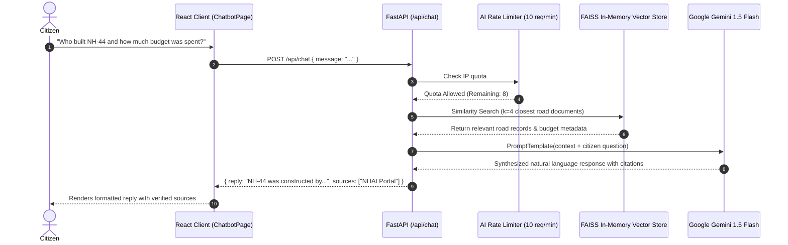

- **Vectorization Pipeline:** On system startup, road entities are converted into structured text blocks with contractor names, repair timestamps, sanctioned budgets, and expenditures.
- **Embeddings:** Vectorized through Google's `models/embedding-001`.
- **In-Memory Store:** Stored in a high-speed **FAISS** index (`IndexFlatL2`).
- **Resilient Fallback Mode:** If the Gemini API key is absent or exhausted, the system automatically falls back to a deterministic keyword search (`_fallback_search`), ensuring zero downtime.

---

### 3.4 Data Persistence & Storage Tier

The storage architecture supports both zero-configuration local development and production database deployments:
- **Local Development:** SQLite database (`roadwatch.db`) with `check_same_thread=False`.
- **Production Staging & Live:** **Supabase PostgreSQL** via SQLAlchemy connection pooling (`pool_size=10`, `max_overflow=20`, `pool_recycle=1800`, SSL enforced with `sslmode=require`).
- **Inspection Media Store:** Local directory (`backend/uploads/`) mounted as static files at `/uploads/`, housing before/during/after repair inspection photographs.

---

## 🔄 Data Flow & Lifecycle Sequence Diagrams

### 4.1 Citizen Complaint & Priority Recalculation Lifecycle

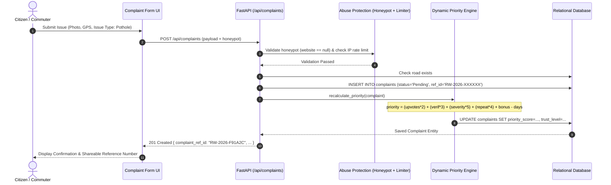

---

### 4.2 Repair Project & Citizen Verification Consensus Lifecycle

The platform transitions road repairs through an immutable 6-stage lifecycle, concluding only when citizen community feedback verifies the repair quality:

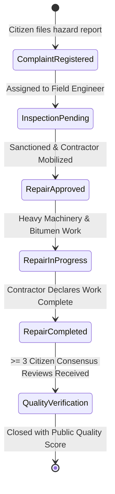

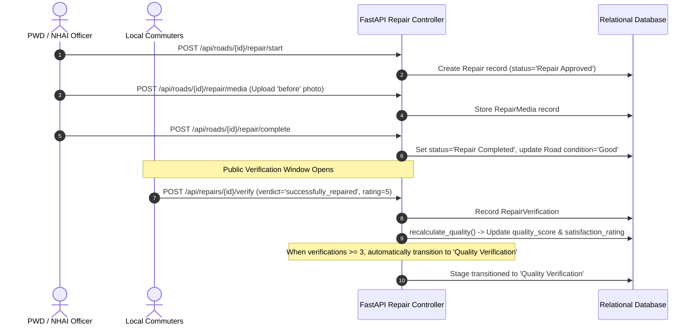

---

### 4.3 Smart Authority Complaint Routing Engine

Complaints filed on RoadWatch do not get dumped into an undifferentiated inbox. They are automatically routed based on statutory jurisdiction:

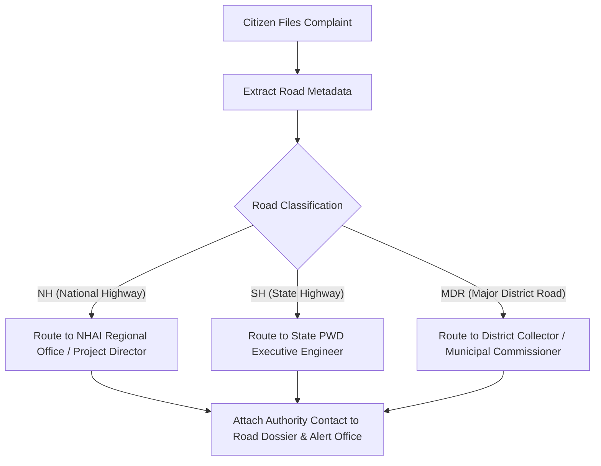

---

## 🗄️ Database Schema & Entity-Relationship Architecture

The relational schema links infrastructure assets, civic reporting, community verification, and administrative audit trails:

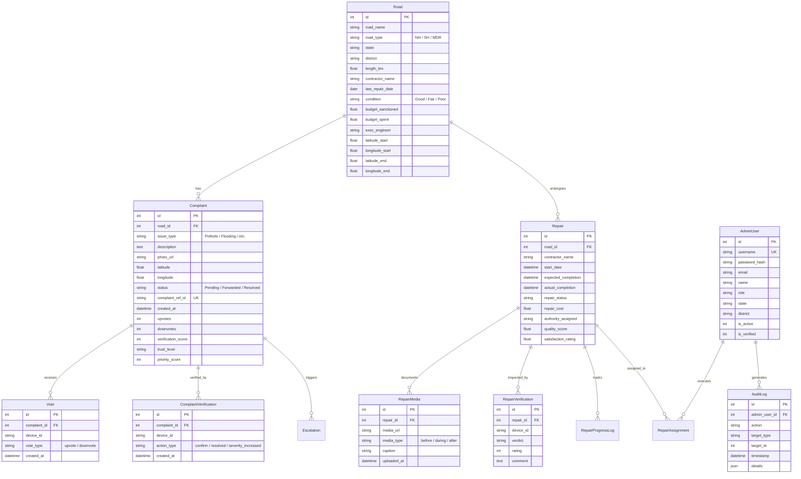

---

## 🧮 Core Scoring & Decision Algorithms

### 6.1 Road Transparency Index (0–100)

Every road tracked in the platform is evaluated through a transparent, deterministic algorithm:

$$\text{Transparency Score} = S_{\text{recency}} + S_{\text{budget}} + S_{\text{complaints}}$$

```
1. Repair Recency Factor (Max: 40 pts)
   ├─ Last repaired < 180 days ago: 40 pts
   ├─ Last repaired < 365 days ago: 30 pts
   ├─ Last repaired < 730 days ago: 15 pts
   └─ Older or unrecorded:           5 pts

2. Budget Utilization Efficiency (Max: 40 pts)
   ├─ Spend ratio between 70% and 100%: 40 pts (Optimal expenditure)
   ├─ Spend ratio between 50% and 69%:  25 pts (Under-utilized allocation)
   ├─ Spend ratio > 100%:               10 pts (Cost-overrun penalty / red flag)
   └─ Spend ratio < 50%:                 5 pts (Severe unspent funds)

3. Citizen Complaint Penalty (Max: 20 pts)
   ├─ 0 unresolved complaints:          20 pts
   ├─ 1 to 3 complaints:               15 pts
   ├─ 4 to 10 complaints:               5 pts
   └─ > 10 complaints:                  0 pts
```

---

### 6.2 Dynamic Complaint Priority & Trust Scoring

Complaints are automatically ranked to ensure critical hazards bubble to the top of the administrative queue:

$$\text{Priority Score} = (V_{\text{up}} \times 2) + (S_{\text{verif}} \times 3) + (W_{\text{severity}} \times 5) + (C_{\text{repeat}} \times 4) + B_{\text{transparency}} - \Delta_{\text{days}}$$

- **$V_{\text{up}}$:** Net citizen upvotes registered.
- **$S_{\text{verif}}$:** Cumulative verification score (Confirm = +1, Resolved = +1, Severity Increased = +2).
- **$W_{\text{severity}}$:** Severity factor (Pothole: 5, Flooding: 4, Missing Barrier: 4, Bad Surface: 3, No Signage: 2, Other: 1).
- **$C_{\text{repeat}}$:** Count of co-located unresolved complaints on the same road.
- **$B_{\text{transparency}}$:** Road Neglect Bonus ($[100 - \text{Road Transparency Score}] / 10$).
- **$\Delta_{\text{days}}$:** Age decay factor based on days elapsed since submission.

#### Community Consensus Auto-Resolution
If **5 or more distinct citizen devices** independently verify an issue as `"resolved"`, the system automatically transitions the complaint status from `Pending` or `Forwarded` to `Resolved`.

---

### 6.3 Contractor Accountability & Quality Scoring

Each contractor receives an aggregated accountability rating based on physical outcomes:

$$\text{Contractor Score} = (Q_{\text{avg}} \times 0.6) + (R_{\text{citizen}} \times 20 \times 0.4) - (N_{\text{repeat}} \times 15)$$

- **$Q_{\text{avg}}$:** Average quality score (0–100) derived from citizen verifications.
- **$R_{\text{citizen}}$:** Average star rating (1.0–5.0) normalized to 100.
- **$N_{\text{repeat}}$:** Count of road sections requiring repeat intervention within 12 months (repeat failure penalty).

---

## 🔒 Security, Governance & Anti-Abuse Architecture

### 7.1 Defense-in-Depth Security Matrix

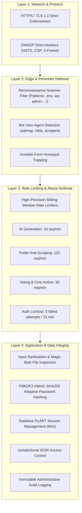

---

### 7.2 Role-Based Access Control (RBAC) & Jurisdictional Scoping

To prevent **Insecure Direct Object Reference (IDOR)** attacks, every administrative mutation is validated against the authenticated officer's geographic jurisdiction:

| Administrative Role | Geographic Scope | Allowed Operations |
|---|---|---|
| **Super Admin** | National (All States) | System-wide configuration, officer onboarding, global audits |
| **State Authority** | State-level (e.g., Tamil Nadu) | State road updates, complaints dispatch, state officer onboarding |
| **District Collector** | District-level (e.g., Chennai) | District tenders, escalation reviews, district budget ledgers |
| **PWD / NHAI Engineer** | Assigned Roads & District | Repair lifecycle updates, milestone logging, inspection photo uploads |
| **Complaint Inspector** | District-level | Site inspections, citizen responses, status transitions |

```python
# Jurisdictional verification enforcement in security.py
def verify_resource_jurisdiction(user: AdminUser, state: Optional[str], district: Optional[str], action_name: str):
    if "Super Admin" in user.role:
        return  # Unrestricted national oversight
    if user.state and state and user.state.lower() != state.lower():
        raise HTTPException(status_code=403, detail="Jurisdiction violation: Cross-state access prohibited")
    if user.district and district and user.district.lower() != district.lower():
        raise HTTPException(status_code=403, detail="Jurisdiction violation: Cross-district access prohibited")
```

---

### 7.3 Tiered Sliding-Window Rate Limiting

The application implements a thread-safe sliding window rate limiter (`abuse_protection.py`) configured across distinct operational tiers:

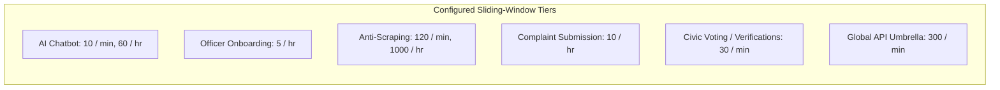

---

## 🌐 Data Ingestion & Integration Pipelines

RoadWatch ingests infrastructure datasets from two main conduits:

1. **OpenStreetMap Overpass QL Pipeline (`data_ingestion.py`):**
   - Directly interfaces with `https://overpass-api.de/api/interpreter`.
   - Fetches live `motorway`, `trunk`, and `primary` highways tagged with `ref=NH*` or `ref=SH*` across designated Indian states.
   - Converts OpenStreetMap nodes and tags into RoadWatch database entities without requiring external proprietary API keys.
2. **Bulk CSV Spreadsheet Ingestion:**
   - Enables public works departments to ingest bulk historical project registers.
   - Validates CSV headers, sanitizes values against injection attacks, enforces file size caps (10MB), and upserts road geometries.

---

## 🚀 Physical Deployment & Infrastructure Topology

The production architecture is optimized for cloud deployment with automated scaling and resilience against server sleep states:

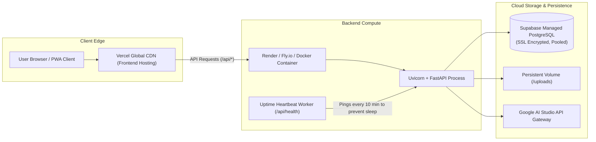

### Self-Healing Free Tier Uptime Heartbeat
Render and similar container hosts power down free web services after 15 minutes of inactivity. RoadWatch mitigates this with:
- Lightweight ping endpoints: `/api/health`, `/api/keep-alive`, `/api/ping`.
- The frontend initiates a 60-second Axios timeout (`timeout: 60000`) with visual spinners to gracefully accommodate cold starts.

---

## 📂 Repository File Map

```
RoadWatch/
├── ARCHITECTURE.md                  # Complete System Architecture Specification (This Document)
├── README.md                        # Project Overview, Quick Start, and Hackathon Submission Dossier
├── .env.example                     # Environment configuration reference
│
├── frontend/                        # React 19 Client Application
│   ├── src/
│   │   ├── components/              # Reusable UI widgets & functional elements
│   │   ├── pages/                   # Application route views & screens
│   │   ├── api.js                   # Axios client with JWT interceptor & offline queue
│   │   ├── App.jsx                  # Root router, layouts, and online/offline event handlers
│   │   └── index.css                # Glassmorphic Tailwind CSS design system
│   ├── public/                      # Static assets & manifest files
│   ├── package.json                 # Node dependencies
│   ├── vite.config.js               # Vite build configuration
│   └── vercel.json                  # Vercel deployment routing rules
│
└── backend/                         # FastAPI Application Tier
    ├── main.py                      # REST endpoints, middleware, and lifecycle startup
    ├── models.py                    # SQLAlchemy ORM definitions & scoring algorithms
    ├── schemas.py                   # Pydantic request & response validation schemas
    ├── security.py                  # Cryptographic utilities, JWT, IDOR checks, audit logger
    ├── abuse_protection.py          # Sliding-window rate limiters, honeypots, bot filters
    ├── chatbot.py                   # LangChain + Gemini 1.5 Flash + FAISS RAG engine
    ├── sanitizer.py                 # File magic-byte validator and XSS/SQLi sanitizers
    ├── data_ingestion.py            # OpenStreetMap Overpass & CSV bulk import pipeline
    ├── database.py                  # SQLAlchemy engine & connection pooling configuration
    ├── seed_data.py                 # Initial data seeder (20 Indian roads across 5 states)
    ├── requirements.txt             # Python dependencies
    └── Dockerfile                   # Production container definition
```

---

<p align="center">
  <b>Built for the IIT Madras Road Safety Hackathon 2026</b><br>
  <i>Centre of Excellence for Road Safety (CoERS) & RBG Labs</i>
</p>
